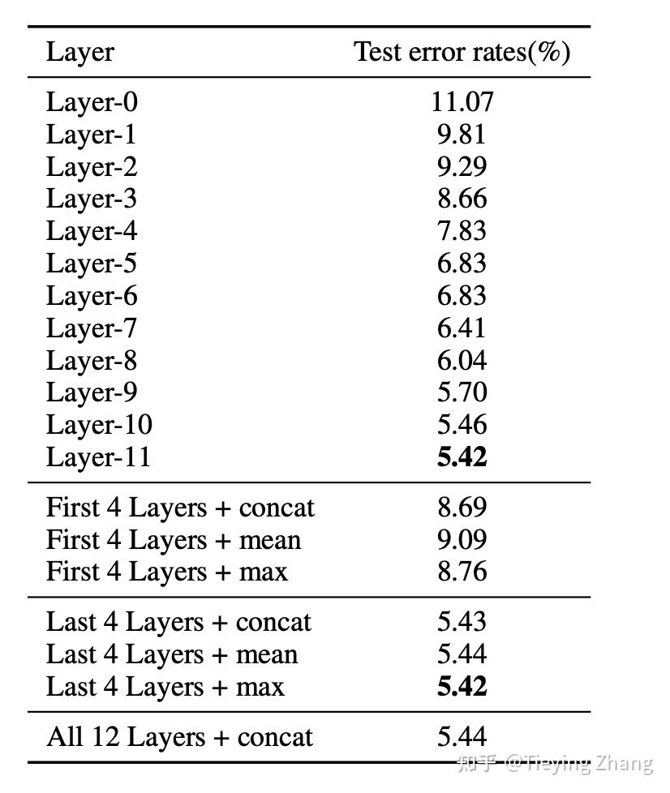
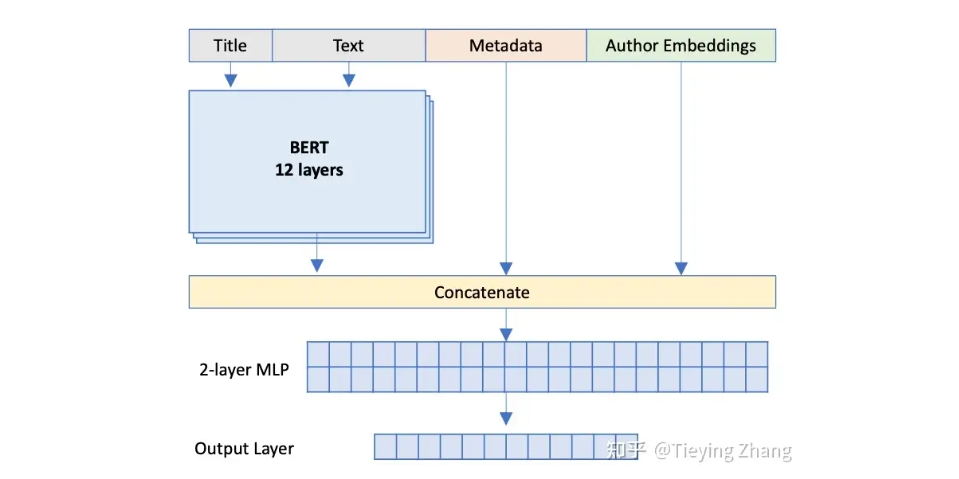

<style>
details {
    border: 1px solid #aaa;
    border-radius: 4px;
    padding: .5em .5em 0;
}
summary {
    font-weight: bold;
    margin: -.5em -.5em 0;
    padding: .5em;
}
details[open] {
    padding: .5em;
}
details[open] summary {
    border-bottom: 1px solid #aaa;
    margin-bottom: .5em;
}
img {
    pointer-events: none;
}
</style>

<details><summary>目录</summary><p>

- [Pre-trained Model](#pre-trained-model)
- [迁移学习](#迁移学习)
    - [迁移学习介绍](#迁移学习介绍)
    - [计算机视觉迁移学习](#计算机视觉迁移学习)
    - [通俗解释](#通俗解释)
- [Fine-tune](#fine-tune)
    - [什么是微调](#什么是微调)
    - [为什么要微调](#为什么要微调)
    - [如何微调](#如何微调)
    - [通俗解释](#通俗解释-1)
- [大模型 fine-tune 示例](#大模型-fine-tune-示例)
    - [语言大模型-BERT 微调](#语言大模型-bert-微调)
    - [图片大模型-ResNet50 微调](#图片大模型-resnet50-微调)
        - [微调](#微调)
        - [固定层的向量导出](#固定层的向量导出)
    - [知识注入](#知识注入)
- [参考](#参考)
</p></details><p></p>


# Pre-trained Model

> Pre-trained Model，预训练模型

Pre-trained Model 是指之前通过大量的数据训练出的大模型（如果不是大模型，
用少量数据训练的小模型能直接用在新的任务上也可以，但是一般来说少量数据没有强大的迁移能力，
所以一般都是指大模型），比如很大很耗时间的模型，又不想从头训练一遍。
这时候可以直接下载别人训练好的模型，里面保存的都是每一层的参数配置情况。有了这样的模型之后，
可以直接拿来做测试，前提是输出的类别是一样的。

Pre-trained Model 可以直接使用或者 fine tune 后用在新的任务上。
一般把 Pre-tained Model 分为三类：**图像大模型**、**语言大模型（LLM）**、
**Meta learning（一般指 few-shot learning）**。
这三类模型都是先通过在已有数据集上进行训练，然后在任务数据集上 fine tune。
从实用的角度，先把 Meta learning 排除掉，还处于研究和探索阶段。
在工业界真正用起来的，一般是图像大模型和语言大模型。而图像大模型最常用的是 ResNet，
语言大模型是 Transformer 的各类变种，如 BERT 系列和 GPT 系列。

概括来说，ResNet 和 BERT 都是 fine tune 最后几层（有的方法也会再训练整个模型），
因为前几层提取了公共信息，比如 ResNet 前几层提取了颜色、形状等公共信息，
BERT 前几层提取了词性、语义等公共信息。后几层往往和训练任务关联了，
比如 BERT 后几层是关注填空的准确度，所以后几层和你想做的任务关系不是很大。
所以一般是固定前面几层的模型参数，fine tune 后面几层参数。

另外，Pre-trained Model 也不局限在图像大模型和语言大模型，如果有一个简单的 DNN 训练出来，
可以用在新的任务上，也可以称之为 Pre-tained Model，总之通过已有数据训练出的模型，
直接（或fine tune）后用在不同任务上，就可以称之为 Pre-trained Model。

# 迁移学习

> Transfer Learning


## 迁移学习介绍

总是有人把迁移学习和神经网络的训练联系起来，这两个概念刚开始是无关的。
迁移学习是机器学习的分支，现在之所以迁移学习和神经网络联系如此紧密，
是因为现在图像识别发展的太快效果也太好了，所以几乎所有的迁移学习都是图像识别方向的，
所以大家看到的迁移学习基本上都是以神经网络相关的计算机视觉为主。

迁移学习初衷是节省人工标注样本的时间，
让模型可以通过一个已有的标记数据的领域向未标记数据领域进行迁移从而训练出适用于该领域的模型，
直接对目标域从头开始学习成本太高，故而转向运用已有的相关知识来辅助尽快地学习新知识。

举一个简单的例子就能很好的说明问题，我们学习编程的时候会学习什么？
语法、特定语言的 API、流程处理、面向对象，设计模式等等。
这里面语法和 API 是每一个语言特有的，但是面向对象和设计模式可是通用的，
我们学了 JAVA，再去学 C#，或者 Python，面向对象和设计模式是不用去学的，
因为原理都是一样的，甚至在学习 C# 的时候语法都可以少学很多，这就是迁移学习的概念，
把统一的概念抽象出来，只学习不同的内容。

迁移学习按照学习方式可以分为 **基于样本的迁移**、**基于特征的迁移**、**基于模型的迁移**，
以及 **基于关系的迁移**，这里就不详细介绍了。

其实 "Transfer Learning" 和 "Fine-tune" 并没有严格的区分，含义可以相互交换，
只不过后者似乎更常用于形容迁移学习的后期微调中。微调应该是迁移学习中的一部分。
微调只能说是一个 trick。

## 计算机视觉迁移学习

下面只介绍下[计算机视觉方向的迁移学习](https://cs231n.github.io/transfer-learning/)。

在实践中，很少有人从头开始训练整个卷积网络（随机初始化），因为拥有足够大小的数据集相对较少。
相反，通常在非常大的数据集（例如 ImageNet，包含 120 万张图像和 1000 个类别）上预训练 ConvNet，
然后使用 ConvNet 作为感兴趣任务的初始化或固定特征提取器。三个主要的迁移学习场景如下：

1. ConvNet 作为固定特征提取器。
    - 在 ImageNet 上预训练 ConvNet，删除最后一个全连接层（该层的输出是 ImageNet 等不同任务的 1000 个类别分数），
      然后将 ConvNet 的其余部分视为新数据集的固定特征提取器。
    - 在 AlexNet 中，这将为每个图像计算一个 4096 维向量，其中包含紧邻分类器之前的隐藏层的激活。
      我们将这些特征称为 CNN 代码。如果这些代码在 ImageNet 上的 ConvNet 训练期间也被阈值化（通常是这种情况），
      那么这些代码是 ReLUd（即阈值为零）对于性能非常重要。
      提取所有图像的 4096-D 代码后，为新数据集训练线性分类器（例如线性 SVM 或 Softmax 分类器）。
2. Fine-tuning ConvNet
    - 第二种策略是不仅在新数据集上替换并重新训练 ConvNet 之上的分类器，
      而且还通过继续反向传播来微调预训练网络的权重。可以微调 ConvNet 的所有层，
      也可以保持某些较早的层固定（由于过度拟合问题），而仅微调网络的某些较高级别部分。
      这是由于观察到 ConvNet 的早期特征包含更多通用特征（例如边缘检测器或颜色斑点检测器），
      这些特征对许多任务都有用，但 ConvNet 的后续层逐渐变得更加具体于类的细节包含在原始数据集中。
      以包含许多狗品种的 ImageNet 为例，ConvNet 的表示能力的很大一部分可能专门用于区分狗品种的特定特征。
3. Pre-trained Model
    - 这个其实和上面第二种是一个意思，不过比较极端，使用整个 Pre-trained Model 作为初始化，
      然后 fine-tune 整个网络而不是某些层，但是这个的计算量是非常大的，就只相当于做了一个初始化。
    - 由于现代 ConvNet 在 ImageNet 上跨多个 GPU 进行训练需要 2-3 周的时间，
      因此人们经常会发布最终的 ConvNet 检查点，以便其他可以使用网络进行微调的人受益。
      例如，Caffe 库有一个 Model Zoo，人们可以在其中共享他们的网络权重。

何时以及如何进行微调？如何决定应该在新数据集上执行哪种类型的迁移学习？
这是多个因素的函数，但最重要的两个因素是新数据集的大小（小或大），
以及它与原始数据集的相似性（例如，在图像内容和类别方面类似于 ImageNet，
或非常不同，例如显微镜图像）。请记住，ConvNet 特征在早期层中更通用，
在后面层中更特定于原始数据集，以下是用于导航 4 个主要场景的一些常见经验规则：

1. 新数据集很小并且与原始数据集相似。
    - 由于数据很小，由于过度拟合的担忧，对 ConvNet 进行微调并不是一个好主意。
      由于数据与原始数据相似，我们预计 ConvNet 中的更高级别特征也与该数据集相关。
      因此，最好的想法可能是在 CNN 代码上训练线性分类器。
2. 新数据集很大并且与原始数据集相似。
    - 由于我们拥有更多数据，因此我们可以更有信心，如果我们尝试通过整个网络进行微调，
      我们就不会过度拟合。
3. 新数据集很小，但与原始数据集有很大不同。
    - 由于数据很小，因此最好只训练线性分类器。由于数据集非常不同，
      因此从网络顶部训练分类器可能不是最好的，因为网络顶部包含更多数据集特定的特征。
      相反，从网络中较早某个位置的激活来训练 SVM 分类器可能效果更好。
4. 新数据集很大并且与原始数据集有很大不同。
    - 由于数据集非常大，我们可能期望能够从头开始训练 ConvNet。
      然而，在实践中，使用预训练模型的权重进行初始化通常仍然是有益的。
      在这种情况下，我们将有足够的数据和信心来对整个网络进行微调。

实用建议。执行迁移学习时还需要记住一些其他事项：

1. 来自预训练模型的约束。
    - 请注意，如果您希望使用预训练网络，则可用于新数据集的架构可能会受到一些限制。
      例如，你不能任意从预训练网络中取出 Conv 层。然而，一些变化是直接的：由于参数共享，
      您可以轻松地在不同空间大小的图像上运行预训练的网络。这在 Conv/Pool 层的情况下非常明显，
      因为它们的前向函数独立于输入体积空间大小（只要步幅“适合”）。
      对于 FC 层，这仍然成立，因为 FC 层可以转换为卷积层：例如，
      在 AlexNet 中，第一个 FC 层之前的最终池化体积的大小为 [6x6x512]。
      因此，查看此体积的 FC 层相当于具有感受野大小为 6x6 的卷积层，并应用 0 的填充。
2. 学习率。
    - 与计算新数据集类别分数的新线性分类器的（随机初始化）权重相比，
      通常对正在微调的 ConvNet 权重使用较小的学习率。
      这是因为我们期望 ConvNet 权重相对较好，因此我们不希望太快、
      太多地扭曲它们（特别是当它们上面的新线性分类器正在通过随机初始化进行训练时）。

## 通俗解释

举个例子，假设今天老板给你一个新的数据集，让你做一下图片分类，这个数据集是关于 flowers 的。
问题是，数据集中 flower 的类别很少，数据集中的数据也不多，你发现从零训练开始训练 CNN 的效果很差，
很容易过拟合。怎么办呢，于是你想到了使用 Transfer Learning，用别人已经训练好的 Imagenet 的模型来做。
做的方法有很多：

1. 把 AlexNet 里卷积层最后一层输出的特征拿出来，然后直接用 SVM 分类。这是 Transfer Learning，
   因为你用到了 AlexNet 中已经学到了的“知识”。
2. 把 VggNet 卷积层最后的输出拿出来，用贝叶斯分类器分类。思想基本同上。
3. 甚至你可以把 AlexNet、VggNet 的输出拿出来进行组合，自己设计一个分类器分类。
   这个过程中你不仅用了 AlexNet 的“知识”，也用了 VggNet 的“知识”。
4. 最后，你也可以直接使用 fine-tune 这种方法，在 AlexNet 的基础上，重新加上全连接层，再去训练网络。

综上，Transfer Learning 关心的问题是：什么是“知识”以及如何更好地运用之前得到的“知识”。
这可以有很多方法和手段。而 fine-tune 只是其中的一种手段。

简单来说 Transfer learning 可以看成是一套完整的体系，是一种处理流程，
目的是为了不抛弃从之前数据里得到的有用信息，
也是为了应对新进来的大量数据的缺少标签或者由于数据更新而导致的标签变异情况。
至于说 fine-tune，在深度学习里面，这仅仅是一个处理手段。之所以现在大量采用 fine-tune，
是因为有很多人用实验证实了：单纯从自己的训练样本训练的模型，效果没有 fine-tune 的好。
学术界的风气本就如此，一个被大家证实的行之有效的方法会在短时间内大量被采用。

# Fine-tune

## 什么是微调

针对于某个任务，自己的训练数据不多，那怎么办？没关系，我们先找到一个同类的别人训练好的模型，
把别人现成的训练好了的模型拿过来，换成自己的数据，调整一下参数，再训练一遍，这就是微调（fine-tune）。
PyTorch 里面提供的经典的网络模型都是官方通过 Imagenet 的数据集与训练好的数据，
如果我们的数据训练数据不够，这些数据是可以作为基础模型来使用的。

## 为什么要微调

1. 对于数据集本身很小（几千张图片）的情况，从头开始训练具有几千万参数的大型神经网络是不现实的，
   因为越大的模型对数据量的要求越大，过拟合无法避免。这时候如果还想用上大型神经网络的超强特征提取能力，
   只能靠微调已经训练好的模型。
2. 可以降低训练成本：如果使用导出特征向量的方法进行迁移学习，后期的训练成本非常低，
   用 CPU 都完全无压力，没有深度学习机器也可以做。
3. 前人花很大精力训练出来的模型在大概率上会比你自己从零开始搭的模型要强悍，没有必要重复造轮子。

## 如何微调

对于不同的领域微调的方法也不一样，比如语音识别领域一般微调前几层，图片识别问题微调后面几层，
原因如下：

* 对于图片来说，CNN 的前几层学习到的都是低级的特征，比如，点、线、面，
  这些低级的特征对于任何图片来说都是可以抽象出来的，所以将它们作为通用数据，
  只微调这些低级特征组合起来的高级特征即可，例如，这些点、线、面，组成的是圆还是椭圆，
  还是正方形，这些代表的含义是我们需要后面训练出来的。
* 对于语音来说，每个单词表达的意思都是一样的，只不过发音或者是单词的拼写不一样，
  比如 苹果，apple，apfel（德语），都表示的是同一个东西，只不过发音和单词不一样，
  但是他具体代表的含义是一样的，就是高级特征是相同的，所以我们只要微调低级的特征就可以了。

## 通俗解释

> fine-tune，微调

> 一个通俗的场景例子说明一下 Fine-tune 的机制。
> 
> 假设有一家公司，我们把它看作是一个 AI 模型，它曾经从事过机械制造/外贸/AR 领域的业务，
> 相当于这个 AI 模型在这 3 个领域被训练过，能熟悉得处理这些领域的问题。
> 
> 这家公司内部有 100 个员工，我们看作是 100 个神经元，它们按照不同部门分成 DNN 里的不同层。
> 每个员工脑袋里记忆的信息相当于每个神经元的权重，它们涵盖了机械制造/外贸/AR 三个领域的特征。
> 
> 如今，这家公司因为业务调整/改造，准备进军大飞机制造行业，具体业务是利用 AR 设备协助飞机内布线。
> 由于这是一个垂直行业，公司决定在现有基础上对 100 个员工针对性的培训(Fine-tune)一下，
> 发放了相关的学习资料(Fine-tune 所需的训练数据)。
> 
> 这次公司改造并不增加员工数量，仅仅是对现有员工的业务能力改造。
> 每个员工的大脑容量是固定的，不能追加新知识，那么就必须 “遗忘” 一些以前学习过的知识，
> 好装入新的领域知识，本质上就是对已有的权重做修正。
> 
> 那么要遗忘哪些？当然是跟AR和大飞机制造无关的知识，比如先前已经掌握的外贸业务知识，
> 机械制造领域的知识有部分被遗忘，还有一些跟布线有关的可以保留，员工大脑里腾出的空间就用来装新知识了。
> 
> 整个过程中，预训练的知识同新领域知识的关联程度决定了它被改造的程度，关联性越大，保留的越多，反之越少。
> 
> 这个被改造后的公司如果再去面对外贸业务就会很不适应了。
> 
> 以上过程中，改造的基础是建立在新旧知识的差异性上，
> 也就是说 AI 模型（公司本身）没有为这次改造设定特定的规则，完全是数据差异驱动的改造。
> 
> 事实上，可以设定一些简单规则，来优化改造过程。比如 Diffusion 领域的 DreamBooth，
> 它有一个概念叫做 Preservation。对应到刚才的例子，我们假设这次业务是针对一家外国大飞机制造公司的，
> 那么我们希望保留外贸业务中的结算能力，外贸的其它知识可以抛弃，那么在 Fine-tune 的时候，
> 特地把以前已经学会过的外贸结算知识也加入到这次的学习材料中，使得改造后的公司不至于错误得遗忘结算能力。
> 
> 一般来讲，DNN 中哪一层会被改造以及被改造的程度，就要看新旧知识在这些层面上的关联程度了。

# 大模型 fine-tune 示例

## 语言大模型-BERT 微调

简单说一下 BERT 是怎么训练的。简单来说 BERT 训练就是填空题，把给定的训练语料中某一个字 mask 掉，
可以用 `[CLS]` 这个特殊字符来代替，输出位置是一个相应的 vector，
这个 **vector** 再输入到一个 **linear 层** 然后做 **softmax 变换**，最后**和 label 做 loss 计算**。

注意，上面的过程中，从输入 `[CLS]` 到输出的 vector（linear 层之前）是 BERT。
BERT 的内部结构是 Transformer 的 encoder 部分，是 12 层（block）的 encoder，
而 BERT 的训练过程是 **BERT** + **Linear 层** + **softmax**，一起来训练，训练完毕后，
BERT 部分单独拿出来使用，也就是把 12 层的 encoder 的参数拿来用。


Fine tune 是指大模型（这里可以看做 BERT）用在下游任务中的训练过程。
从上面可以看到，BERT 是已经训练完毕的 12 层 encoder，其大小是 110~340 个 million 的参数，
可以看到非常的大。下游任务是指你自己要做的任务，通常包括句子分类，词性分类等。
以句子分类为例子（如下图），
首先 BERT 已经被预训练好（上面说的填空题方式预训练的 340 个 million 的参数的 12 层encoder），
然后以该 BERT 为基础，后面接一个 linear 层构成整体 fine tune 的结构，
输入是特殊字符 `[CLS]` + 一句话，`[CLS]` 位置的输出作为 linear 层的输入，
linear 的输出作为最后的输出和 label 计算 loss，反向更新整个 linear + BERT。

那么 fine tune 到底要 tune 哪里？是要 fine tune 整个模型还是最后一层，还是哪几层？
上面的例子中是 fine tune 是训练了整个 BERT+linear，真实场景中也往往先固定 BERT 的前面几层，
然后 fine tune 最后一层或者最后 3~4 层 + linear。对于不同领域，fine tune 的方法也不太一样。

BERT 往往 fine tune 最后几层：




## 图片大模型-ResNet50 微调

使用 PyTorch 训练好的 ResNet50 对狗的种类识别来做一个简单的微调实例。

### 微调

```python
import os

import numpy as np
import pandas as pd
import matplolib.pyplot as plt
from PIL import Image
from sklearn.model_selection import StratifiedShuffleSplit

import torch
import torchvision
import torch.nn as nn
import torch.nn.functional as F
import torch.utils.data import DataLoader, Dataset
from torchvision import datasets, models, transforms
print(torch.__vision__)

# ------------------------------
# Data
# ------------------------------
# 下载官方的数据(https://www.kaggle.com/c/dog-breed-identification)解压，只要保持数据的目录结构即可
DATA_ROOT = "data"
all_labels_df = pd.read_csv(os.path.join(DATA_ROOT, "label.csv"))
print(all_labels_df.head())
# 获取狗的分类，根据分进行编号
breeds = all_labels_df.breed.unique()
breed2idx = dict(breed, idx) for idx, breed in enumerate(breeds)
# idx2breed = dict(idx, breed) for idx, breed in enumerate(breeds)
# 上面定义两个字典，分别以名字和 id 作为对应，添加到列表中
all_labels_df["label_idx"] = [breed2idx[b] for b in all_labels_df.breed]
print(all_labels_df.head())

# 定义一个数据集
class DogDataset(Dataset):

    def __init__(self, labels_df, img_path, transform = None):
        self.labels_df = labels_df
        self.img_path = img_path
        self.transform = transform

    def __len__(self):
        return self.labels_df.shape[0]

    def __getitem__(self, idx):
        image_name = os.path.join(self.img_path, self.labels_df.id[idx]) + ".jpg"
        img = Image.open(image_name)
        label = self.labels_df.label_idx[idx]

        if self.transform:
            img = self.transform(img)

        return img, label

# 定义一些超参数
IMG_SIZE = 224  # resnet50 的输入是 224，需要将图片统一大小
BATCH_SIZE= 256  # 这个批次大小需要占用 4.6-5g 的显存，如果不够的化可以改下批次，如果内存超过 10G 可以改为 512
IMG_MEAN = [0.485, 0.456, 0.406]
IMG_STD = [0.229, 0.224, 0.225]
DEVICE = torch.device("cuda" if torch.cuda.is_available() else "cpu")

# 定义训练和验证数据的图片变换规则
train_transforms = transforms.Compose([
    transforms.Resize(IMG_SIZE),
    transforms.RandomResizedCrop(IMG_SIZE),
    transforms.RandomHorizontalFlip(),
    transforms.RandomRotation(30),
    transforms.ToTensor(),
    transforms.Normalize(IMG_MEAN, IMG_STD),
])
val_transforms = transforms.Compose([
    transforms.Resize(IMG_SIZE),
    transforms.CenterCrop(IMG_SIZE),
    transforms.ToTensor(),
    transforms.Normalize(IMG_MEAN, IMG_STD),
])

# 分割 10% 数据作为训练时的验证数据
stratified_split = StratifiedShuffleSplit(n_splits = 1, test_size = 0.1, random_state = 0)
train_split_idx, val_split_idx = next(iter(stratified_split.split(all_labels_df.id, all_labels_df.breed)))
train_df = all_labels_df.iloc[train_split_idx].reset_index()
val_df = all_labels_df.iloc[val_split_idx].reset_index()
print(len(train_df))
print(len(val_df))

# 创建 DataLoader
train_dataset = DogDataset(
    train_df, 
    os.path.join(DATA_ROOT, "train"), 
    transform = train_transforms,
)
val_datgaset = DogDataset(
    val_df,
    os.path.join(DATA_ROOT, "train"),
    transform = val_transforms,
)
train_dataloader = DataLoader(
    train_dataset,
    batch_size = BATCH_SIZE,
    shuffle = True, 
    num_workers = 0,
)
val_dataloader = DataLoader(
    val_dataset,
    batch_size = BATCH_SIZE,
    shuffle = True, 
    num_workers = 0,
)

dataset_names = ["train", "test"]
image_transforms = {"train", train_transforms, "valid": val_transforms}
image_dataset = {"train": train_dataset, "valid": val_dataset}
image_dataloader = {"train": train_dataloader, "val": val_dataloader}

# ------------------------------
# Model
# ------------------------------
# 配置网络，由于 ImageNet 是识别 1000 个物体，我们的数据狗一共只有 120，所以需要对模型的最后一层全连接层进行微调，
model_ft = models.resnet50(pretrained = True)
# 将所有的参数进行冻结
for param in model_ft.parameters():
    param.requires_grad = False
# 打印全连接层的信息
print(model_ft.fc)

# 获取到 fc 层的输入
num_fc_ftr = model_ft.fc.in_features 
# 定义一个新的 FC 层，新模型
model_ft.fc = nn.Linear(num_fc_ftr, len(breeds))
model_ft = model_ft.to(DEVICE)
print(model_ft)

# ------------------------------
# Model Training
# ------------------------------
# 设置训练参数
criterion = nn.CrossEntropyLoss()
optimizer = torch.optim.Adam([{"params": model_ft.fc.parameters()}], lr = 0.001)

# 定义训练函数
def train(model, device, train_loader, epoch):
    passmodel.train()
    for batch_idx, data in enumerate(train_loader):
        x, y = data
        x, y = x.to(device), y.to(device)
        optimizer.zero_grad()
        y_hat = model(x)
        loss = criterion(y_hat, y)
        loss.backward()
        optimizer.step()
    print ('Train Epoch: {}\t Loss: {:.6f}'.format(epoch, loss.item()))


# 定义测试函数
def test(model, device, test_loader):
    model.eval()
    test_loss = 0
    correct = 0
    with torch.no_grad():
        for i,data in enumerate(test_loader):          
            x,y = data
            x, y =x.to(device), y.to(device)
            optimizer.zero_grad()
            y_hat = model(x)
            test_loss += criterion(y_hat, y).item()  # sum up batch loss
            pred = y_hat.max(1, keepdim = True)[1]  # get the index of the max log-probability
            correct += pred.eq(y.view_as(pred)).sum().item()
    test_loss /= len(test_loader.dataset)
    print('\nTest set: Average loss: {:.4f}, Accuracy: {}/{} ({:.0f}%)\n'.format(
        test_loss, 
        correct, 
        len(val_dataset),
        100.0 * correct / len(val_dataset)
    ))


# 训练
for epoch in range(1, 10):
    train(model = model_ft, 
          device = DEVICE, 
          train_loader = image_dataloader["train"], 
          epoch = epoch)
    test(model = model_ft, 
         device = DEVICE, 
         test_loader = image_dataloader["valid"])

```

看到只训练了9次就达到了80%的准确率，效果还是可以的。
但是每次训练都需要将一张图片在全部网络中进行计算，
而且计算的结果每次都是一样的，这样浪费了很多计算的资源。
面我们就将这些不进行反向传播或者说不更新网络权重参数层的计算结果保存下来，
这样我们以后使用的时候就可以直接将这些结果输入到 FC 层或者以这些结果构建新的网络层，
省去了计算的时间，并且这样如果只训练全连接层，CPU 就可以完成了。

### 固定层的向量导出

采用 PyTorch 比较高级的 API hook 来处理了，首先要定义一个 `hook` 函数：

```python
# 这里存放所有的输出
in_list = [] 
def hook(module, input, output):
    """
    Params:
        input 是一个 tuple 代表顺序代表每一个输入项，这里只有一项，所以直接获取
    """
    # 需要全部的参数信息可以使用这个打印
    for val in input:
        print("input val:", val)
    
    for i in range(input[0].size(0)):
        in_list.append(input[0][i].cpu().numpy())


# 在相应的层注册 `hook` 函数，保证函数能够正常工作，
# 这里直接 `hook` 全连接层前面的 `pool` 层，
# 获取 `pool` 层的输入数据，这样会获得更多的特征
model_ft.avgpool.register_forward_hook(hook)


# 开始获取输出，这里因为不需要反向传播，所以直接可以使用 `no_grad` 嵌套
with torch.no_grad():
    for batch_idx, data in enumerate(image_dataloader["train"]):
        x, y = data
        x, y = x.to(DEVICE), y.to(DEVICE)
        y_hat = model_ft(x)


features = np.array(in_list)
np.save("features", features)
```

这样再训练时只需将这个数组读出来，然后可以直接使用这个数组再输入到 linear 或者前面讲到的 sigmod 层就可以了。
这里在 pool 层前获取了更多的特征，可以将这些特征使用更高级的分类器，例如 SVM，树型的分类器进行分类。


## 知识注入

fine tune 最后 4 层已经足够了，其实很多任务 fine tune 最后一层就可以。
另外对于特殊任务，知识注入也是非常有效的一种方式。知识注入有两种方式：

* 在 BERT embedding 层注入：通过将外部 Embedding 与 Bert token-embedding 拼接（相加）进行融合；
* 在 BERT 后的一层，拼接外部 Embedding，
  如 [Enriching BERT with Knowledge Graph Embeddings for Document Classification]() 中，
  通过在 Transformer 的最后一层中拼接其他信息，提高模型的性能。



# 参考

* [关于 Pre-train 和 Fine-tuning](https://www.cnblogs.com/jiading/p/11995883.html)
* [Pre-trained Model 是什么以及 fine-tune 是如何工作的](https://zhuanlan.zhihu.com/p/599037143)
* [fine-tuning: 利用已有模型训练其他数据集](https://zhuanlan.zhihu.com/p/22624331)
* [如何提升 BERT 在下游任务中的性能](https://xv44586.github.io/2020/11/24/fine-tune/)
* [https://cs231n.github.io/](https://cs231n.github.io/)
