<style>
details {
    border: 1px solid #aaa;
    border-radius: 4px;
    padding: .5em .5em 0;
}
summary {
    font-weight: bold;
    margin: -.5em -.5em 0;
    padding: .5em;
}
details[open] {
    padding: .5em;
}
details[open] summary {
    border-bottom: 1px solid #aaa;
    margin-bottom: .5em;
}
img {
    pointer-events: none;
}
</style>

<details><summary>目录</summary><p>

- [MATLAB 下载](#matlab-下载)
- [MATLAB 安装](#matlab-安装)
    - [解压安装文件](#解压安装文件)
    - [运行安装文件](#运行安装文件)
    - [安装 MATLAB](#安装-matlab)
    - [安装好的 MATLAB](#安装好的-matlab)
- [MATLAB 命令行工具](#matlab-命令行工具)
- [参考](#参考)
</p></details><p></p>

# MATLAB 下载

夸克网盘地址 1：

* [地址：(https://pan.quark.cn/s/acfe48cd47af#/list/share)](https://pan.quark.cn/s/acfe48cd47af#/list/share)
* 提取码：rsrz

夸克网盘地址 2：

* [地址：(https://pan.quark.cn/s/c669fb805e88)](https://pan.quark.cn/s/c669fb805e88)
* 提取码：xtfl

# MATLAB 安装

## 解压安装文件

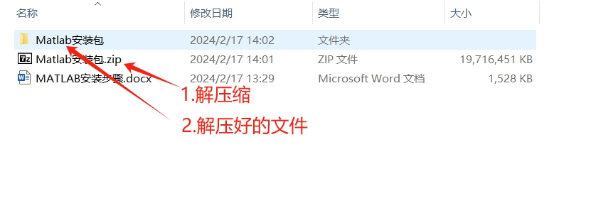

## 运行安装文件

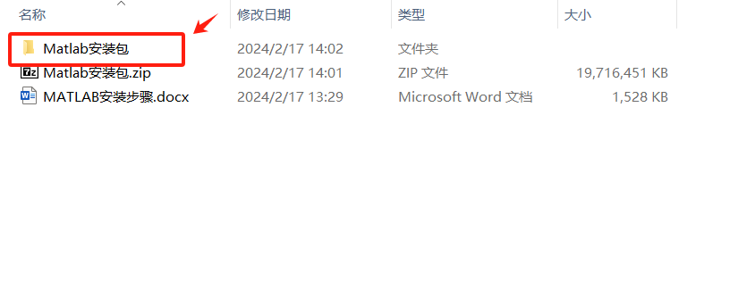

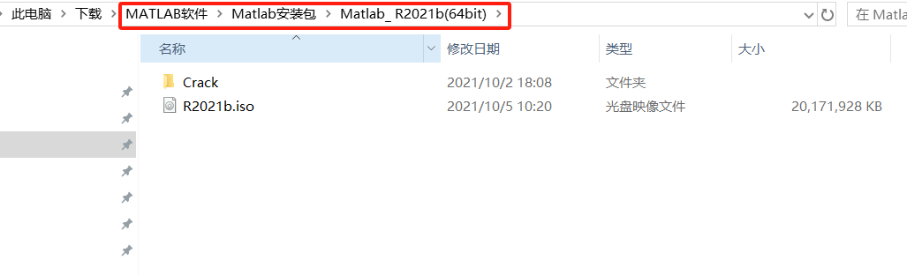

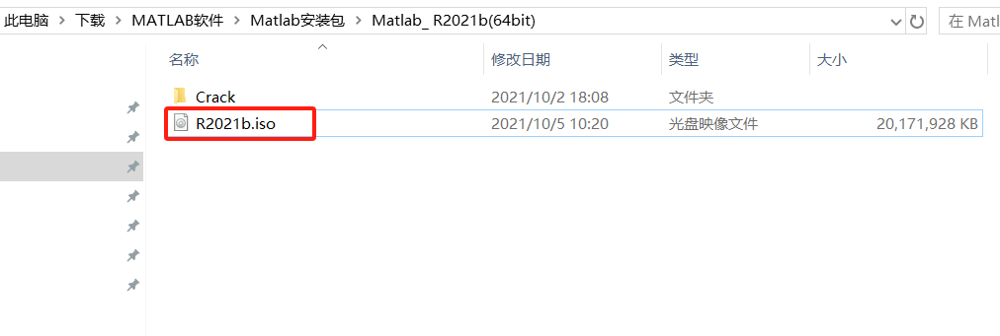

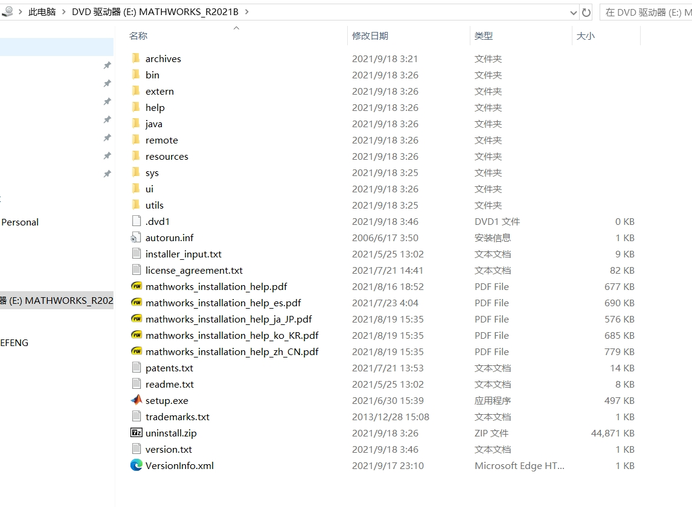


## 安装 MATLAB


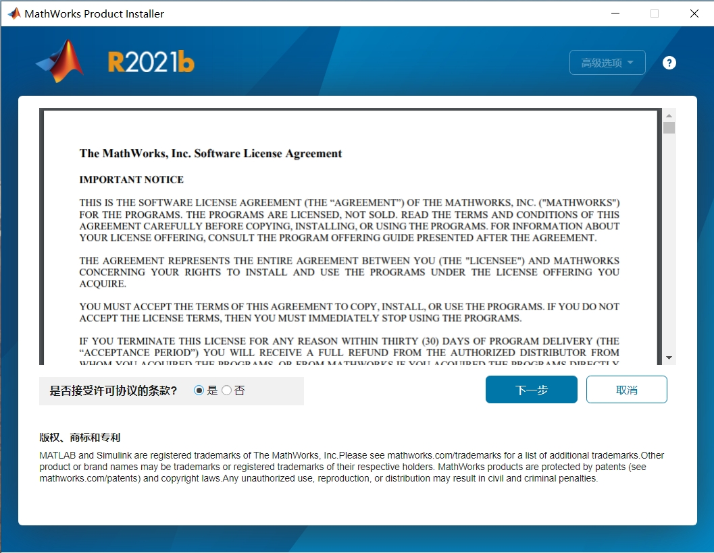


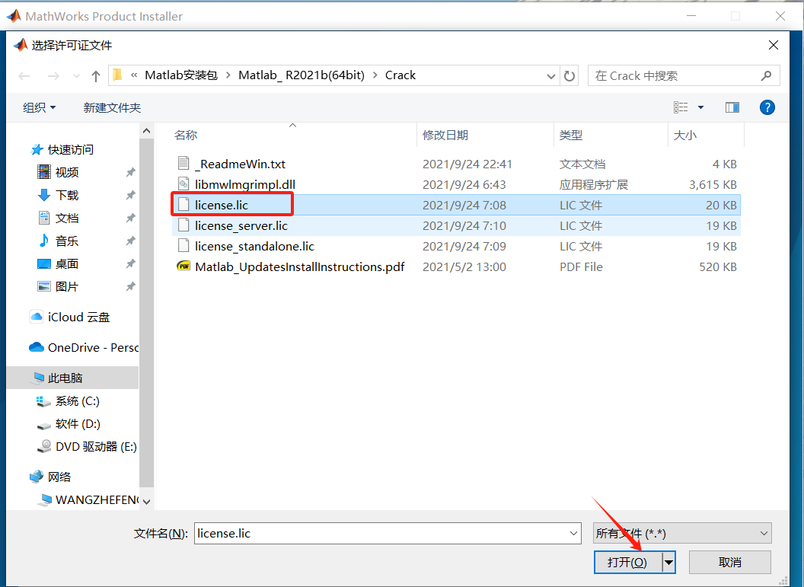

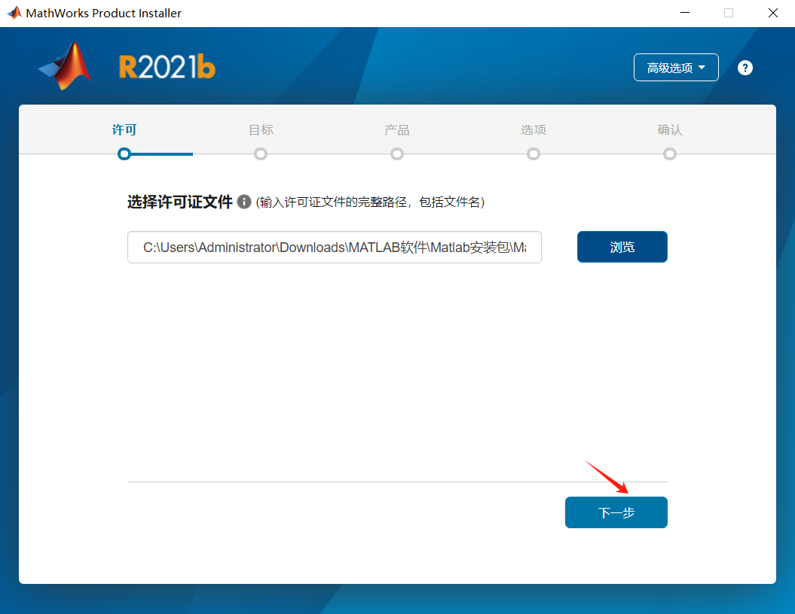

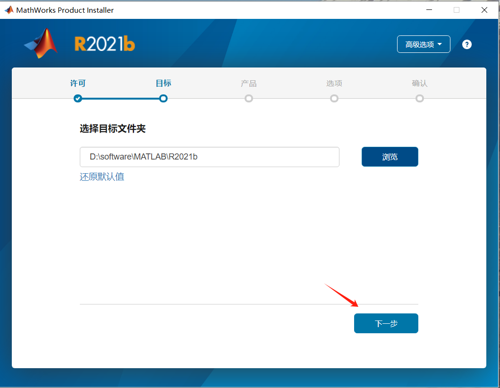

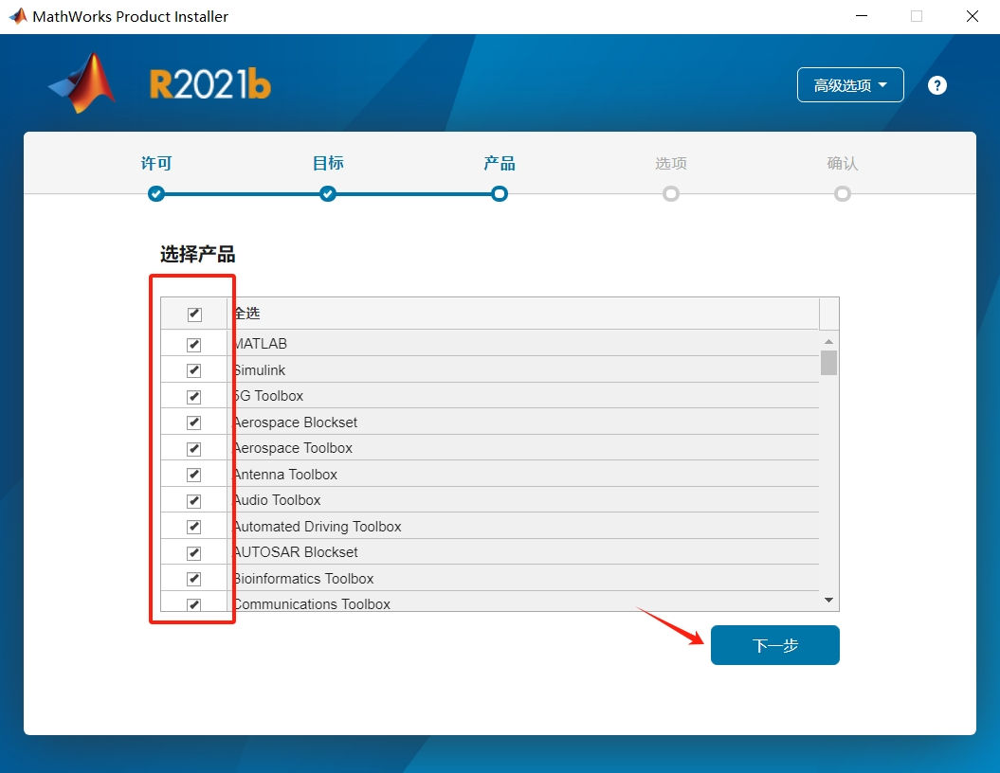

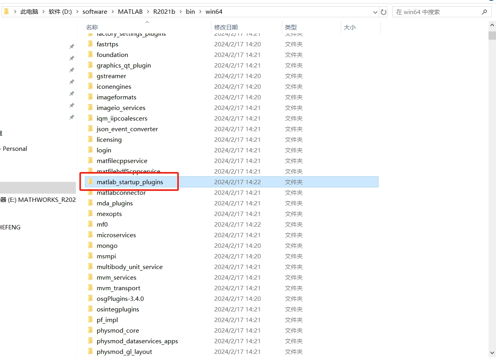

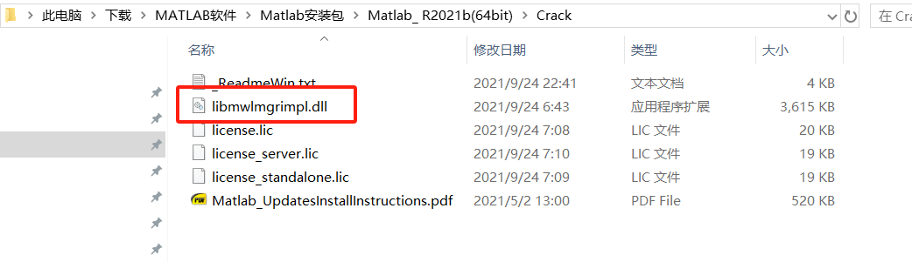

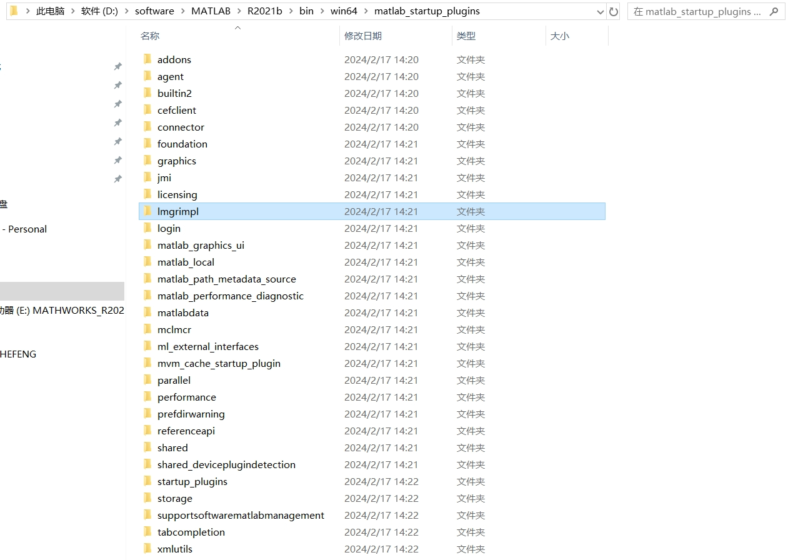

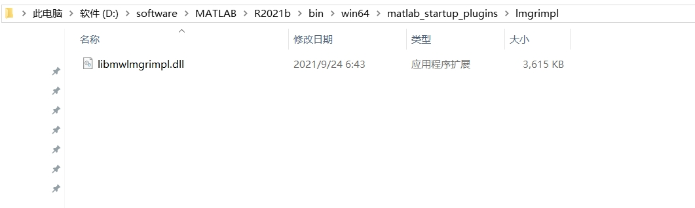

## 安装好的 MATLAB

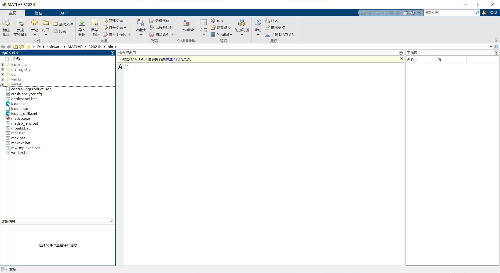

# MATLAB 命令行工具

* `help`：在命令行窗口显示指定命令的简短使用说明

```bash
# 用于查看 eig 函数的帮助文档，查询结果在命令行窗口显示
$ help eig
```

* `doc`：以网页形式显示指定命令的帮助页，此命令显示的标准更加具体，还有各种使用举例

```bash
# 用于查看 eig 函数帮助文档，结果在单独的查看显示，比 help 显示更加完整详细
$ doc eig
```

* `lookfor`：按指定的关键词查询与之相关的命令

```bash
# 模糊查找，比如知道某个可能的函数是 plo***，但是不知道完整的函数名称，就可以使用这个命令
$ lookfor eig
```

* `which`：显示指定函数所在的目录

```bash
# 查找函数具体在什么位置
$ which eig
```

* `cd`

* `dir`


# 参考

* [matlab入门图文教程](https://zhuanlan.zhihu.com/p/77669451)
* [最新MATLAB R2020b超详细安装教程](https://www.cnblogs.com/sixuwuxian/p/13973003.html#title1)