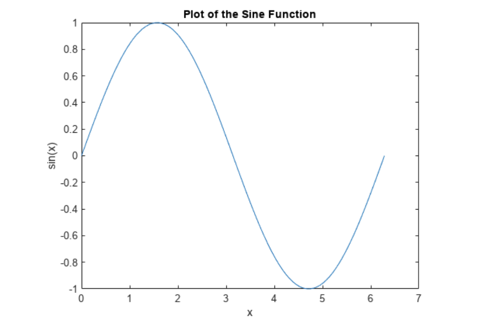
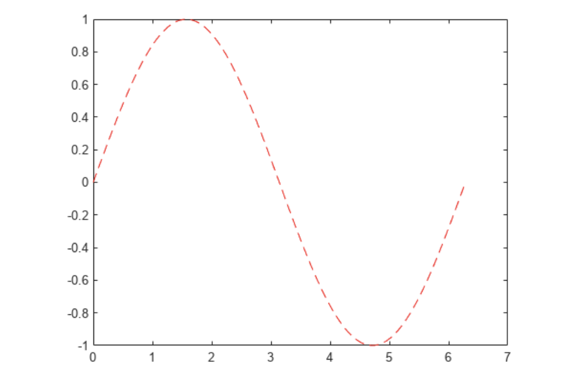
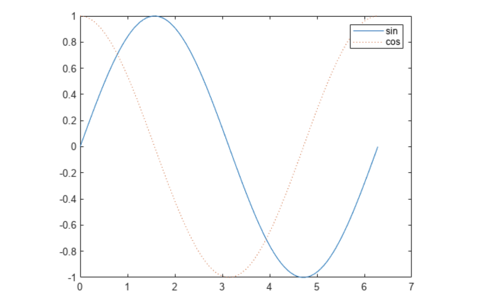
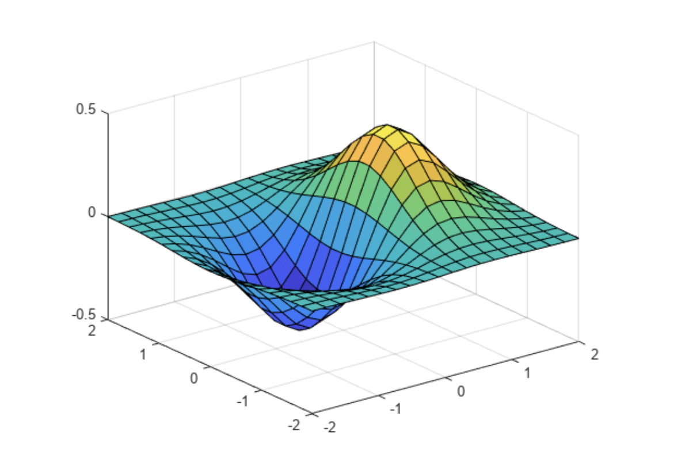

<style>
details {
    border: 1px solid #aaa;
    border-radius: 4px;
    padding: .5em .5em 0;
}
summary {
    font-weight: bold;
    margin: -.5em -.5em 0;
    padding: .5em;
}
details[open] {
    padding: .5em;
}
details[open] summary {
    border-bottom: 1px solid #aaa;
    margin-bottom: .5em;
}
img {
    pointer-events: none;
}
</style>

<details><summary>目录</summary><p>

- [快速入门](#快速入门)
    - [二维绘图](#二维绘图)
        - [线图 plot](#线图-plot)
    - [三维绘图](#三维绘图)
        - [surf 函数及 mesh 函数](#surf-函数及-mesh-函数)
    - [多个绘图](#多个绘图)
- [二维图和三维图](#二维图和三维图)
    - [线图](#线图)
    - [数据分布图](#数据分布图)
    - [离散数据图](#离散数据图)
    - [地理图](#地理图)
    - [极坐标图](#极坐标图)
    - [等高线图](#等高线图)
    - [向量场](#向量场)
    - [曲面、体积和多边形](#曲面体积和多边形)
    - [动画](#动画)
- [格式和注释](#格式和注释)
- [图像](#图像)
- [打印和保存](#打印和保存)
- [图形对象](#图形对象)
- [图形性能](#图形性能)
- [精选示例](#精选示例)
</p></details><p></p>

Matlab 图形函数包括二维和三维绘图函数，用于以可视化形式呈现数据和通信的结果。
以交互方式或编程方式自定义绘图。

Matlab 图形包括：

* 二维绘图
* 三维绘图
* 图像
* 动画

# 快速入门

## 二维绘图

### 线图 plot

要创建二维线图，需要使用 `plot` 函数。

例如，绘制在从 `$0$` 到 `$2\pi$` 的值组成的线性间距向量上的正弦函数：

```matlab
x = linspace(0, 2*pi);
y = sin(x);
plot(x, y)
xlabel("x")
ylabel("sin(x)")
title("Plot of the Sine Function")
```



通过向 `plot` 函数添加第三个输入参数 `"r--"`，可以使用其他类型线条绘制相同的变量。
在线条设定中，每个设定可包含表示线条 <span style='border-bottom:1.5px dashed red;'>颜色</span>、<span style='border-bottom:1.5px dashed red;'>样式</span> 和 <span style='border-bottom:1.5px dashed red;'>标记的字符</span>。
标记是在绘制的每个数据点上显示的符号，例如，`+`、`o` 或 `*`。例如，`"g:*"` 请求绘制使用 `*` 标记的绿色点线。

```matlab
x = linspace(0, 2*pi);
y = sin(x);
plot(x, y, "r--")
xlabel("x")
ylabel("sin(x)")
title("Plot of the Sine Function")
```



为第一幅绘图定义的标题和标签不再被用于当前的图窗窗口中。
默认情况下，每次调用绘图函数、重置坐标区及其他元素以准备新绘图时，
MATLAB 都会清空图窗。要将绘图添加到现有图窗中，
请使用 `hold on`。在使用 `hold off` 或关闭窗口之前，当前图窗窗口中会显示所有绘图。

```matlab
x = linspace(0, 2*pi);
y = sin(x);
plot(x, y)

hold on

y2 = cos(x);
plot(x, y2, ":")
legend("sin", "cos")

hold off
```



## 三维绘图

三维图通常显示一个由带两个变量的函数 `$z=f(x,y)$` 定义的曲面图。

例如，对于给定的行向量和列向量 `$x$` 和 `$y$`，每个向量包含 `$[-2,2]$` 范围内的 20 个点，
计算 `$z=xe^{-x^{2}-y^{2}}$`：

```matlab
x = linspace(-2, 2, 20);
y = x;
z = x .* exp(-x.^2 - y.^2);

% 创建曲面图
surf(x, y, z)
```



### surf 函数及 mesh 函数

`surf` 函数及其伴随函数 `mesh` 以三维形式显示曲面图。
`surf` 使用颜色显示曲面图的连接线和面。`mesh` 生成仅以颜色标记连接线条的线框曲面图。


## 多个绘图

可以使用 `tiledlayout` 或 `subplot` 在同一窗口的不同部分显示多个绘图。

`tiledlayout` 函数是在 R2019b 中引入的，该函数比 `subplot` 提供更多对标签和间距的控制。
例如，在图窗窗口中创建 2×2 布局。然后，每当您要某个绘图出现在下一区域中时，请调用 `nexttile`。
如果使用的版本早于 R2019b，请参阅 `subplot`。

```matlab
t = tiledlayout(2, 2);
title(t, "Trigonometric Function");
x = linspace(0, 30);

nexttile
plot(x, sin(x))
title("Sine")

nexttile
plot(x, cos(x))
title("Cosine")

nexttile
plot(x, tan(x))
title("Tangent")

nexttile
plot(x,, sec(x))
title("Secant")
```

# 二维图和三维图

> 绘制连续、离散、曲面以及三维体数据图

## 线图


## 数据分布图


## 离散数据图


## 地理图


## 极坐标图


## 等高线图


## 向量场


## 曲面、体积和多边形


## 动画


# 格式和注释

> 添加标签、调整颜色、定义坐标轴范围、应用光照或透明度、设置相机视图


# 图像

> 读取、写入、显示和修改图像


# 打印和保存

> 打印和导出为标准文件格式


# 图形对象

> 通过设置底层对象的属性自定义图形


# 图形性能

> 优化代码以改善性能

# 精选示例


