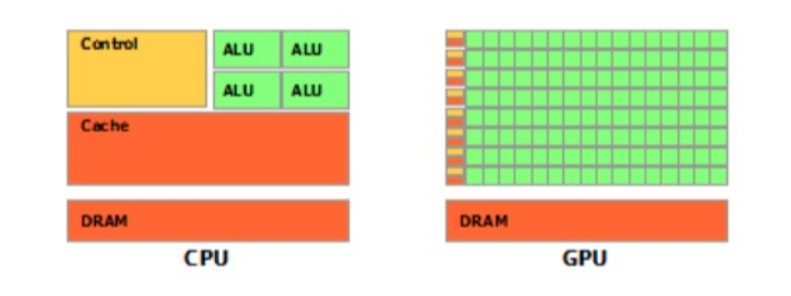

<style>
details {
    border: 1px solid #aaa;
    border-radius: 4px;
    padding: .5em .5em 0;
}
summary {
    font-weight: bold;
    margin: -.5em -.5em 0;
    padding: .5em;
}
details[open] {
    padding: .5em;
}
details[open] summary {
    border-bottom: 1px solid #aaa;
    margin-bottom: .5em;
}
img {
    pointer-events: none;
}
</style>

<details><summary>目录</summary><p>

- [GPU 与 CPU](#gpu-与-cpu)
- [PyTorch GPU 相关操作](#pytorch-gpu-相关操作)
    - [PyTorch 的设备](#pytorch-的设备)
    - [torch.cuda](#torchcuda)
    - [查看 GPU 设备是否可用](#查看-gpu-设备是否可用)
    - [查看 GPU 设备数量](#查看-gpu-设备数量)
    - [将张量在 GPU 和 CPU 之间移动](#将张量在-gpu-和-cpu-之间移动)
        - [to 函数](#to-函数)
        - [tensor](#tensor)
        - [tensor on gpu](#tensor-on-gpu)
        - [tensor on cpu](#tensor-on-cpu)
        - [将模型中的全部张量移动到 GPU 上](#将模型中的全部张量移动到-gpu-上)
        - [创建支持多个 GPU 数据并行的模型](#创建支持多个-gpu-数据并行的模型)
- [PyTorch GPU 模型训练方式](#pytorch-gpu-模型训练方式)
    - [GPU 训练模型](#gpu-训练模型)
    - [多 GPU 训练模型](#多-gpu-训练模型)
- [PyTorch GPU 使用示例](#pytorch-gpu-使用示例)
    - [矩阵乘法示例](#矩阵乘法示例)
        - [使用 CPU](#使用-cpu)
        - [使用 GPU](#使用-gpu)
    - [线性回归示例](#线性回归示例)
        - [使用 CPU](#使用-cpu-1)
        - [使用 GPU](#使用-gpu-1)
    - [图片分类示例](#图片分类示例)
        - [使用 CPU 训练](#使用-cpu-训练)
        - [使用 GPU 训练](#使用-gpu-训练)
    - [训练循环中使用 GPU](#训练循环中使用-gpu)
        - [torchkeras.KerasModel 中使用 GPU](#torchkeraskerasmodel-中使用-gpu)
        - [torchkeras.LightModel 中使用 GPU](#torchkeraslightmodel-中使用-gpu)
- [参考](#参考)
</p></details><p></p>

深度学习模型训练过程的耗时主要来自于两个部分，一部分来自数据准备，另一部分来自参数迭代。
当数据准备过程还是模型训练时间的主要瓶颈时，可以使用更多进程来准备数据。
当参数迭代过程成为训练时间的主要瓶颈时，通常的方法是应用 GPU 来进行加速。

# GPU 与 CPU

在处理器家族中，有两大阵营，分别是 CPU 和 GPU，它们分工协作，共同完成计算机复杂功能。
但它们两者主要差别在哪里？

* CPU(central processing unit, 中央处理器) 主要包括两个部分，即控制器、运算器，除此之外还包括高速缓存等；
* GPU(Graphics Processing Unit, 图形处理器) 是为处理类型统一并且相互无依赖的大规模数据运算，
  以及不需要被打断的纯净的计算环境为设计的处理器，因早期仅有图形图像任务中设计大规模统一无依赖的运算，
  因此该处理器称为图像处理器，俗称显卡。

那么它们之间主要区别在哪里呢，来看一张示意图：



上图中，绿色的是 **计算单元**，橙红色的是 **存储单元**，橙黄色的是 **控制单元**，
从示意图中看出，GPUt 的重点在计算，CPU 的重点在控制，这就是两者之间的主要差异。

在 PyTorch 中，可以将训练数据以及模型参数迁移到 GPU 上，这样就可以加速模型的运算。

# PyTorch GPU 相关操作

## PyTorch 的设备

> `torch.device()`

PyTorch 的运算需要将运算数据放到同一个设备上。目前，PyTorch 支持两种设备，CPU 与 cuda，
为什么是 cuda 而不是 GPU？因为早期，只有 Nvidia 的 GPU 能用于模型训练加速，因此称之为 cuda。
即使现在支持了 AMD 显卡进行加速，仍旧使用 cuda 来代替 gpu。

PyTorch中表示设备通常用 `torch.device()` 这个函数进行设置：

```python
>>> torch.device('cuda:0')
device(type='cuda', index=0)

>>> torch.device('cpu')
device(type='cpu')

>>> torch.device('cuda')  # current cuda device
device(type='cuda')
```

## torch.cuda

在 `torch.cuda` 中有几十个关于 cuda 的函数，下面介绍几个常用的函数。

* `torch.cuda.is_available()`：查看 cuda 是否可用
* `torch.cuda.device_count()`：查看可用 GPU 数量
* `torch.cuda.current_device()`：查看当前使用的设备的序号
* `torch.cuda.get_device_name()`：获取设备的名称
* `torch.cuda.get_device_capability(device=None)`：查看设备的计算力
* `torch.cuda.get_device_properties()`：查看GPU属性
* `torch.cuda.set_device(device)`：设置可用设备，已不推荐使用，
  建议通过 `CUDA_VISIBLE_DEVICES` 来设置，下文会讲解 `CUDA_VISIBLE_DEVICES` 的使用。
* `torch.cuda.mem_get_info(device=None)`：查询 GPU 空余显存以及总显存。
* `torch.cuda.memory_summary(device=None, abbreviated=False)`：类似模型的 summary，它将 GPU 的详细信息进行输出。
* `torch.cuda.empty_cache()`：清空缓存，释放显存碎片。
* `torch.backends.cudnn.benchmark = True`：提升运行效率，仅适用于输入数据较固定的，
  如卷积会让程序在开始时花费一点额外时间，为整个网络的每个卷积层搜索最适合它的卷积实现算法，
  进而实现网络的加速让内置的 cuDNN 的 auto-tuner 自动寻找最适合当前配置的高效算法，
  来达到优化运行效率的问题；
* `torch.backends.cudnn.deterministic`：用以保证实验的可重复性。

由于 cnDNN 每次都会去寻找一遍最优配置，会产生随机性，为了模型可复现，
可设置 `torch.backends.cudnn.deterministic = True`。

```python
import torch

device = torch.device("cuda" if torch.cuda.is_available() else "cpu")

print(f"device_count: {torch.cuda.device_count()}")
print(f"current_device: {torch.cuda.current_device()}")
print(torch.cuda.get_device_name())
print(torch.cuda.get_device_capability(device = None))
print(torch.cuda.is_available())
print(torch.cuda.get_arch_list())
print(torch.cuda.get_device_properties(0))
print(torch.cuda.mem_get_info(device = None))
print(torch.cuda.memory_summary(device = None, abbreviated = False))
print(torch.cuda.empty_cache())
```

## 查看 GPU 设备是否可用

```python
import torch

if_cuda = torch.cuda.is_available()
print(f"if_cuda = {if_cuda}")
```

## 查看 GPU 设备数量

```python
import torch

gup_count = torch.cuda.device_count()
print(f"gpu_count = {gpu_count}")
```

## 将张量在 GPU 和 CPU 之间移动

### to 函数

在 PyTorch 中，只需要将要进行运算的数据放到 GPU 上，即可使用 GPU 加速运算。
在模型运算过程中，需要放到 GPU 的主要是两个：

* 输入数据：形式为 `tensor`
* 网络模型：形式为 `module`

PyTorch 中针对这两种数据都有相应的函数把它们放到 GPU 上，就是 `to()` 函数。

* `tensor` 的 `to()` 函数：
    - 功能：转换张量的数据类型或者设备
    - 注意事项：`to()` 函数不是 inplace 操作，所以需要重新赋值，
      这与 `module` 的 `to()` 函数不同
    - 使用：

    ```python
    # 转换数据类型
    x = torch.ones((3, 3))
    x = x.to(torch.float64)

    # 转换设备
    x = torch.ones((3, 3))
    x = x.to("cuda")
    ```

* `module` 的 `to()` 函数：
    - 功能：move and/or cast the parameters and buffers，转换模型中的参数和缓存
    - 注意事项：实行的是 inplace 操作
    - 使用：

    ```python
    # 转换数据类型
    linear = nn.Linear(2, 2)
    print(linear.weight)

    linear.to(torch.double)
    print(linear.weight)

    # 迁移至 GPU
    gpu1 = torch.device("cuda:1")
    linear.to(gpu1)
    print(linear.weight)
    ```

将 `torch.device()` 与 `to()` 函数联合使用：

```python
device = torch.device("cuda" if torch.cuda.is_available() else "cpu")
model.to(device)
inputs, labels = inputs.to(device), labels.to(device)
```

通常，会采用 `torch.cuda.is_available()` 函数来自适应当前设备，若没有 GPU 可用，
自动设置 device 为 CPU，不会影响代码的运行。

### tensor

```python
import torch
from torch import nn

tensor = torch.rand((100, 100))
```

### tensor on gpu

```python
if torch.cuda.is_available():
    tensor_gpu = tensor.to("cuda:0")  
    # or tensor_gpu = tensor.cuda()

    print(tensor_gpu.device)
    print(tensor_gpu.is_cuda)
```

```
device(type='gpu')
True
```

### tensor on cpu

```python
tensor_cpu = tensor_gpu.to("cpu")  
# or tensor_cpu = tensor_gpu.cpu()

print(tensor_cpu.device)
print(tensor_cpu.is_cuda)
```

```
device(type='cpu')
False
```

### 将模型中的全部张量移动到 GPU 上

```python
import tensor
from torch import nn

# 模型
net = nn.linear(2, 1)
print(next(net.parameters()).device)
print(next(net.parameters()).is_cuda)

# 移动模型到 GPU 上
# 注意: 无需重新赋值为 net= = net.to("cuda:0")
if torch.cuda.is_available():
    net.to("cuda:0")
    print(next(net.parameters()).device)
    print(next(net.parameters()).is_cuda)
```

### 创建支持多个 GPU 数据并行的模型

```python
import tensor
from torch import nn

# 模型
linear = nn.Linear(2, 1)
print(next(linear.parameters()).device)
print(next(linear.parameters()).is_cuda)

# 包装模型为并行风格
if torch.cuda.device_count() > 1:
    model = nn.DataParallel(linear)
    print(model.device_ids)
    print(next(model.module.parameters()).device)

    # 保存参数时要指定保存 model.module 的参数
    torch.save(
        model.module.state_dict(), 
        "model_parameter.pt"
    )

    # 加载模型
    linear = nn.Linear(2, 1)
    linear.load_state_dict(torch.load("model_parameter.pt"))
```

# PyTorch GPU 模型训练方式

## GPU 训练模型

PyTorch 中使用 GPU 加速模型非常简单，只要将**模型**和**数据**移动到 GPU 上，
核心代码只有几行：

```python
import torch
print(f"torch.__version__ = {torch.__version__}")
```

设备：

```python
device = torch.device(
    "cuda:0" if torch.cuda.is_available() 
    else "cpu"
)
print(f"Using {device} device")
```

定义模型：

```python
class Net(torch.nn.Module):

    def __init__(self):
        super(Net, self).__init__()
    
    def forward(self, x):
        output = x
        return output

model = Net()
```

移动模型到 CUDA：

```python
model.to(device)
```

训练模型：

```python
model.fit()
```

移动数据到 CUDA：

```python
features = features.to(device)
labels = labels.to(device)
# labels = labels.cuda() if torch.cuda.is_available() else labels
```

## 多 GPU 训练模型

> PyTorch 默认使用单个 GPU 执行运算

如果要使用多个 GPU 训练模型，只需要将模型设置为数据并行风格模型。
模型移动到 GPU 上之后，会在每一个 GPU 上拷贝一个副本，并把数据平分到各个 GPU 上进行训练。

```python
import torch
print(f"torch.__version__ = {torch.__version__}")
```

设备：

```python
device = torch.device(
    "cuda:0" if torch.cuda.is_available() 
    else "cpu"
)
print(f"Using {device} device")
```

定义模型：

```python
class Net(torch.nn.Module):

    def __init__(self):
        super(Net, self).__init__()
    
    def forward(self, x):
        output = x
        return output

model = Net()
```

包装模型为并行风格、移动模型到 CUDA：

```python
if torch.cuda.device_count() > 1:
    print("Let's use", torch.cuda.device_count(), "GPUs!")
    model = torch.nn.DataParallel(model)
    model.to(device)
```

训练模型：

```python
model.fit()
```

移动数据到 CUDA：

```python
features = features.to(device)
labels = labels.to(device)
# labels = labels.cuda() if torch.cuda.is_available() else labels
```

# PyTorch GPU 使用示例

## 矩阵乘法示例

分别使用 CPU 和 GPU 做矩阵乘法，并比较其计算效率

### 使用 CPU

```python
import time
import torch
from torch import nn

a = torch.rand((10000, 200))
b = torch.rand((200, 10000))

tic = time.time()
c = torch.matmul(a, b)
toc = time.time()

print(toc - tic)
print(a.device)
print(b.device)
```

### 使用 GPU

```python
import time
import torch
from torch import nn

# 设备
device = torch.device(
    "cuda:0" if torch.cuda.is_available() 
    else "cpu"
)
print(f"Using {device} device")

a = torch.rand((10000, 200), device = device)
b = torch.rand((200, 10000))
b = b.to(device)  
# or b = b.cuda() if torch.cuda.is_available() else b

tic = time.time()
c = torch.matmul(a, b)
toc = time.time()

print(toc - tic)
print(a.device)
print(b.device)
```

## 线性回归示例

使用 CPU 和 GPU 训练一个线性回归模型的效率

### 使用 CPU

```python
import torch
from torch import nn
```

数据：

```python
n = 1000000  # 样本数量
X = 10 * torch.rand([n, 2]) - 5
w0 = torch.tensor([2.0, -3.0])
b0 = torch.tensor([10.0])
Y = X@w0.t() + b0 + torch.normal(0.0, 2.0, size = [n, 1])
```

定义模型：

```python
class LinearRegression(nn.Module):

    def __init__(self):
        super().__init__()
        self.w = nn.Parameter(torch.randn_like(w0))
        self.b = nn.Parameter(torch.zeros_like(b0))
    
    def forward(self, x):
        return x@self.w.t() + self.b
    
linear = LinearRegression()
```

训练模型：

```python
optimizer = torch.optim.Adam(linear.parameters(), lr = 0.1)
loss_fn = nn.MSELoss()

def train(epoches):
    tic = time.time()
    for epoch in range(epoches):
        optimizer.zero_grad()
        # 正向传播
        Y_pred = linear(X)
        # 损失函数
        loss = loss_fn(Y_pred, Y)
        # 反向传播
        loss.backward()
        # 更新权重参数
        optimizer.step()
        if epoch % 50 == 0:
            print(f"epoch: {epoch}, loss: {loss.item()}")
    toc = time.time()
    print(f"time used: {toc - tic}")

train(500)
```

### 使用 GPU

```python
import torch
from torch import nn
```

设备：

```python
device = torch.device(
    "cuda:0" if torch.cuda.is_available() 
    else "cpu"
)
print(f"Using {device} device")
```

数据：

```python
n = 1000000  # 样本数量
X = 10 * torch.rand([n, 2]) - 5
w0 = torch.tensor([2.0, -3.0])
b0 = torch.tensor([10.0])
Y = X@w0.t() + b0 + torch.normal(0.0, 2.0, size = [n, 1])
```

数据移动到 GPU 上：

```python
if torch.cuda.is_available():
    X = X.cuda()
    Y = Y.cuda()
    print(f"X.device: {X.device}")
    print(f"Y.device: {Y.device}")
```

定义模型：

```python
class LinearRegression(nn.Module):

    def __init__(self):
        super().__init__()
        self.w = nn.Parameter(torch.randn_like(w0))
        self.b = nn.Parameter(torch.zeros_like(b0))
    
    def forward(self, x):
        return x@self.w.t() + self.b
    
linear = LinearRegression()
```

模型移动到 GPU 上：

```python
linear.to(device)
print(f"if on cuda: {next(linear.parameters()).is_cuda}")
```

训练模型：

```python
optimizer = torch.optim.Adam(linear.parameters(), lr = 0.1)
loss_fn = nn.MSELoss()

def train(epoches):
    tic = time.time()
    for epoch in range(epoches):
        optimizer.zero_grad()
        # 正向传播
        Y_pred = linear(X)
        # 损失函数
        loss = loss_fn(Y_pred, Y)
        # 反向传播
        loss.backward()
        # 更新权重参数
        optimizer.step()
        if epoch % 50 == 0:
            print(f"epoch: {epoch}, loss: {loss.item()}")
    toc = time.time()
    print(f"time used: {toc - tic}")

train(500)
```

## 图片分类示例

```python
import torch
from torch import nn
import torchvision
from torchvision import transforms

# 数据转换
transform = transforms.Compose([
    transforms.ToTensor(),
])

# 数据
ds_train = torchvision.datasetes.MNIST(
    root = "mnist/",
    train = True,
    download = True,
    transform = transform,
)
ds_val = torchvision.datasets.MNIST(
    root = "mnist/",
    train = False,
    download = True,
    transform = transform,
)

dl_train = torch.utils.data.DataLoader(
    ds_train,
    batch_size = 128,
    shuffle = True,
    num_workers = 4,
)
dl_val = torch.utils.data.DataLoader(
    ds_val,
    batch_size = 128,
    shuffle = False,
    num_workers = 4,
)

# 模型构建
def create_net():
    net = nn.Sequential()
    net.add_module("conv1", nn.Conv2d(in_channels = 1, out_channels = 32, kernel_size = 3))
    net.add_module("pool1", nn.MaxPool2d(kernel_size = 2, stride = 2))
    net.add_module("conv2", nn.Conv2d(in_channels = 32, out_channels = 64, kernel_size = 5))
    net.add_module("pool2", nn.MaxPool2d(kernel_size = 2, stride = 2))
    net.add_module("dropout", nn.Dropout2d(p = 0.1))
    net.add_module("adaptive_pool", nn.AdaptiveMaxPool2d((1, 1)))
    net.add_module("flatten", nn.Flatten())
    net.add_module("linear1", nn.Linear(64, 32))
    net.add_module("relu", nn.ReLU())
    net.add_module("linear2", nn.Linear(32, 10))
    return net
```

### 使用 CPU 训练

```python
import os
import sys
import time

import numpy as np
import pandas as pd
import datetime
from tqdm import tqdm
from copy import deepcopy

import torch
from torch import nn
from torchmetrics import Accuracy
# 注：
#   多分类使用 torchmetrics 中的评估指标
#   二分类使用 torchkeras.metrics 中的评估指标

def printlog(info):
    nowtime = datetime.datetime.now().strftime('%Y-%m-%d %H:%M:%S')
    print("\n" + "==========" * 8 + "%s" % nowtime)
    print(str(info) + "\n")
```

模型：

```python
net = create_net()
print(net)
```

损失函数、优化器、评价指标：

```python
loss_fn = nn.CrossEntropyLoss()

optimizer = torch.optim.Adam(net.parameters(), lr = 0.01)

metrics_dict = {
    "acc": Accuracy()
}
```

模型训练：

```python
# epochs 相关设置
epochs = 20 
ckpt_path = 'checkpoint.pt'

# early_stopping 相关设置
monitor = "val_acc"
patience = 5
mode = "max"

# 训练循环
history = {}
for epoch in range(1, epochs + 1):
    printlog(f"Epoch {epoch} / {epochs}")
    # ------------------------------
    # 1.train
    # ------------------------------
    net.train()

    total_loss, step = 0, 0    
    loop = tqdm(enumerate(dl_train), total = len(dl_train))
    train_metrics_dict = deepcopy(metrics_dict) 
    for i, batch in loop: 
        features, labels = batch
        # forward
        preds = net(features)
        loss = loss_fn(preds, labels)
        # backward
        loss.backward()
        optimizer.step()
        optimizer.zero_grad()    
        # metrics
        step_metrics = {
            "train_" + name: metric_fn(preds, labels).item()
            for name, metric_fn in train_metrics_dict.items()
        }
        step_log = dict({
            "train_loss": loss.item()
        }, **step_metrics)
        # 总损失和训练迭代次数更新
        total_loss += loss.item()
        step += 1

        if i != len(dl_train) - 1:
            loop.set_postfix(**step_log)
        else:
            epoch_loss = total_loss / step
            epoch_metrics = {
                "train_" + name: metric_fn.compute().item() 
                for name, metric_fn in train_metrics_dict.items()
            }
            epoch_log = dict({
                "train_loss": epoch_loss
            }, **epoch_metrics)
            loop.set_postfix(**epoch_log)
            for name, metric_fn in train_metrics_dict.items():
                metric_fn.reset()
    for name, metric in epoch_log.items():
        history[name] = history.get(name, []) + [metric]
    # ------------------------------
    # 2.validate
    # ------------------------------
    net.eval()    

    total_loss, step = 0, 0
    loop = tqdm(enumerate(dl_val), total =len(dl_val))    
    val_metrics_dict = deepcopy(metrics_dict)     
    with torch.no_grad():
        for i, batch in loop: 
            features, labels = batch            
            #forward
            preds = net(features)
            loss = loss_fn(preds, labels)
            # metrics
            step_metrics = {
                "val_" + name: metric_fn(preds, labels).item() 
                for name,metric_fn in val_metrics_dict.items()
            }
            step_log = dict({
                "val_loss": loss.item()
            }, **step_metrics)
            # 总损失和训练迭代次数更新
            total_loss += loss.item()
            step9 += 1
            if i != len(dl_val) - 1:
                loop.set_postfix(**step_log)
            else:
                epoch_loss = (total_loss / step)
                epoch_metrics = {
                    "val_" + name: metric_fn.compute().item() 
                    for name, metric_fn in val_metrics_dict.items()
                }
                epoch_log = dict({
                    "val_loss": epoch_loss
                }, **epoch_metrics)
                loop.set_postfix(**epoch_log)
                for name, metric_fn in val_metrics_dict.items():
                    metric_fn.reset()
    epoch_log["epoch"] = epoch           
    for name, metric in epoch_log.items():
        history[name] = history.get(name, []) + [metric]
    # ------------------------------
    # 3.early-stopping
    # ------------------------------
    arr_scores = history[monitor]
    best_score_idx = np.argmax(arr_scores) if mode == "max" else np.argmin(arr_scores)
    
    if best_score_idx == len(arr_scores) - 1:
        torch.save(net.state_dict(), ckpt_path)
        print(f"<<<<<< reach best {monitor} : {arr_scores[best_score_idx]} >>>>>>", file = sys.stderr)
    
    if len(arr_scores) - best_score_idx > patience:
        print(f"<<<<<< {monitor} without improvement in {patience} epoch, early stopping >>>>>>", file = sys.stderr)
        break
    net.load_state_dict(torch.load(ckpt_path))

# 模型训练结果
dfhistory = pd.DataFrame(history)
```

### 使用 GPU 训练

```python
import os
import sys
import time

import numpy as np
import pandas as pd
import datetime 
from tqdm import tqdm
from copy import deepcopy

import torch
from torch import nn 
from torchmetrics import Accuracy
# 注：
#   多分类使用torchmetrics中的评估指标，
#   二分类使用torchkeras.metrics中的评估指标

def printlog(info):
    nowtime = datetime.datetime.now().strftime('%Y-%m-%d %H:%M:%S')
    print("\n" + "==========" * 8 + "%s" % nowtime)
    print(str(info) + "\n")
```

模型：

```python
net = create_net()
print(net)
```

损失函数、优化器、评价指标：

```python
loss_fn = nn.CrossEntropyLoss()

optimizer= torch.optim.Adam(net.parameters(), lr = 0.01)

metrics_dict = {
    "acc": Accuracy()
}
```

移动模型到 GPU 上：

```python
device = torch.device("cuda:0" if torch.cuda.is_available() else "cpu")
print(f"Using {deivce} device.")

net.to(device)
loss_fn.to(device)
for name, fn in metrics_dict.items():
    fn.to(device)
```

模型训练：

```python
# 训练循环相关设置
epochs = 20 
ckpt_path = 'checkpoint.pt'

# early_stopping 相关设置
monitor = "val_acc"
patience = 5
mode = "max"

# 模型训练
history = {}
for epoch in range(1, epochs + 1):
    printlog(f"Epoch {epoch} / {epochs}")
    # ------------------------------
    # 1.train
    # ------------------------------
    net.train()    

    total_loss, step = 0, 0    
    loop = tqdm(enumerate(dl_train), total = len(dl_train))
    train_metrics_dict = deepcopy(metrics_dict) 
    for i, batch in loop:     
        features, labels = batch    
        # === 移动数据到 GPU 上 ===
        features = features.to(device)
        labels = labels.to(device)
        # =======================
        # forward
        preds = net(features)
        loss = loss_fn(preds, labels)
        # backward
        loss.backward()
        optimizer.step()
        optimizer.zero_grad()
        #metrics
        step_metrics = {
            "train_" + name: metric_fn(preds, labels).item() 
            for name, metric_fn in train_metrics_dict.items()
        }
        step_log = dict({
            "train_loss": loss.item()
        }, **step_metrics)
        total_loss += loss.item()
        step += 1
        if i != len(dl_train) - 1:
            loop.set_postfix(**step_log)
        else:
            epoch_loss = total_loss / step
            epoch_metrics = {
                "train_" + name: metric_fn.compute().item() 
                for name, metric_fn in train_metrics_dict.items()
            }
            epoch_log = dict({
                "train_loss": epoch_loss
            }, **epoch_metrics)
            loop.set_postfix(**epoch_log)
            for name, metric_fn in train_metrics_dict.items():
                metric_fn.reset()
    for name, metric in epoch_log.items():
        history[name] = history.get(name, []) + [metric]
    # ------------------------------
    # 2.validate
    # ------------------------------
    net.eval()

    total_loss, step = 0,0
    loop = tqdm(enumerate(dl_val), total = len(dl_val))
    val_metrics_dict = deepcopy(metrics_dict) 
    with torch.no_grad():
        for i, batch in loop: 
            features, labels = batch
            # === 移动数据到 GPU 上 ===
            features = features.to(device)
            labels = labels.to(device)
            # =======================
            # forward
            preds = net(features)
            loss = loss_fn(preds, labels)
            # metrics
            step_metrics = {
                "val_" + name: metric_fn(preds, labels).item() 
                for name, metric_fn in val_metrics_dict.items()
            }
            step_log = dict({
                "val_loss": loss.item()
            }, **step_metrics)

            total_loss += loss.item()
            step += 1
            if i != len(dl_val) - 1:
                loop.set_postfix(**step_log)
            else:
                epoch_loss = (total_loss / step)
                epoch_metrics = {
                    "val_" + name: metric_fn.compute().item() 
                    for name, metric_fn in val_metrics_dict.items()}
                epoch_log = dict({
                    "val_loss": epoch_loss
                }, **epoch_metrics)
                loop.set_postfix(**epoch_log)

                for name, metric_fn in val_metrics_dict.items():
                    metric_fn.reset()
    epoch_log["epoch"] = epoch           
    for name, metric in epoch_log.items():
        history[name] = history.get(name, []) + [metric]
    # ------------------------------
    # 3.early-stopping
    # ------------------------------
    arr_scores = history[monitor]
    best_score_idx = np.argmax(arr_scores) if mode == "max" else np.argmin(arr_scores)
    if best_score_idx == len(arr_scores) - 1:
        torch.save(net.state_dict(), ckpt_path)
        print(f"<<<<<< reach best {monitor} : {arr_scores[best_score_idx]} >>>>>>", file = sys.stderr)
    if len(arr_scores) - best_score_idx > patience:
        print(f"<<<<<< {monitor} without improvement in {patience} epoch, early stopping >>>>>>", file = sys.stderr)
        break
    net.load_state_dict(torch.load(ckpt_path))

dfhistory = pd.DataFrame(history)
```

## 训练循环中使用 GPU

在 PyTorch 中使用 GPU 并不复杂，但模型和数据移动还是很麻烦的，
不小心忘记了移动某些数据或者 Module，就会导致报错

### torchkeras.KerasModel 中使用 GPU

```python
# pip install torchkeras

import torch
from torch import nn

import accelerate
from torchkeras import KerasModel
from torchmetrics import Accuracy


accelerator = accelerate.Accelerator()
print(accelerator.device)

# 模型
net = create_net()

# 模型配置
model = KerasModel(
    net = net,
    loss_fn = nn.CrossEntropyLoss(),
    metrics_dict = {
        "acc": Accuracy(),
    },
    optimizer = torch.optim.Adam(net.parameters(), lr = 0.01)
)

# 模型训练
model.fit(
    train_data = dl_train,
    val_data = dl_val,
    epochs = 10,
    patience = 3,
    monitor = "val_acc",
    mode = "max",
)
```

### torchkeras.LightModel 中使用 GPU

```python
# pip install torchkeras

import torch
from torch import nn

import pytorch_lightning as pl
from torchmetrics import Accuracy

from torchkeras import Lightmodel


# 模型
net = create_net()

# 模型配置
model = LightModel(
    net = net,
    loss_fn = nn.CrossEntropyLoss(),
    metrics_dict = {
        "acc": Accuracy(),
    },
    optimizer = torch.optim.Adam(net.parameters(), lr = 0.01),
)

# 设置回调函数
model_ckpt = pl.callbacks.ModelCheckpoint(
    monitor = "val_acc",
    save_top_k = 1,
    mode = "max",
)

# 早停
early_stopping = pl.callbacks.EarlyStopping(
    monitor = "val_acc",
    patience = 3,
    mode = "max",
)

# 设置训练参数
#   gpus=0: 使用 cpu 训练
#   gpus=1: 使用 1 个 gpu 训练
#   gpus=2: 使用 2 个 gpu 训练
#   gpus=-1 使用所有 gpu 训练
#   gpus=[0,1]: 指定使用 0 号和 1 号 gpu 训练
#   gpus="0,1,2,3": 使用 0,1,2,3 号 gpu 训练
#   tpus=1: 使用 1 个 tpu 训练
trainer = pl.Trainer(
    logger = True,
    min_epochs = 3,
    max_epochs = 20,
    gpus = 1,
    callbacks = [
        model_ckpt, 
        early_stopping,
    ],
    enable_progress_bar = True,
)

# 启动训练循环
trainer.fit(model, dl_train, dl_val)
```

# 参考

* [当代研究生应当掌握的5种Pytorch并行训练方法（单机多卡）](https://mp.weixin.qq.com/s/mwGr69QlUBb2naqJXj__0g)
* [Distribution is all you need](https://github.com/tczhangzhi/pytorch-distributed)
